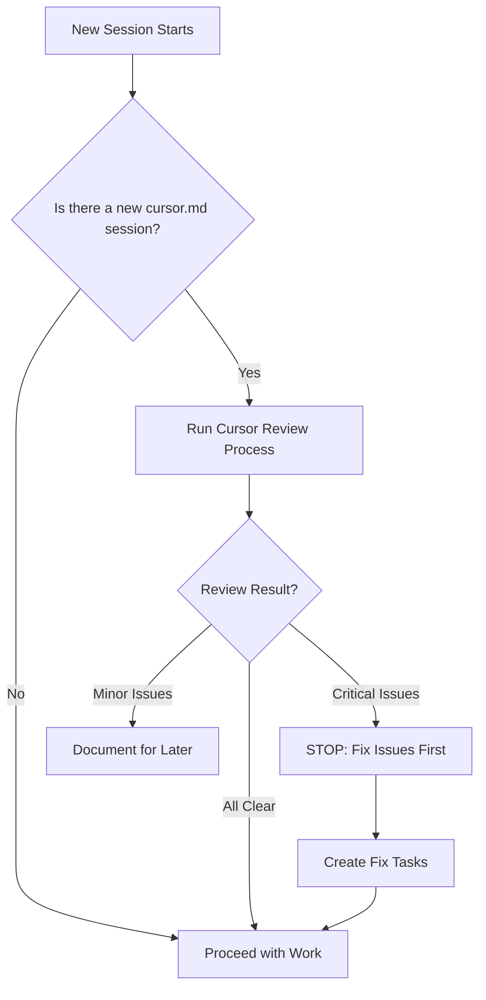

# Cursor Session Review Workflow

## Purpose

This document establishes a **mandatory review process** for all work completed in Cursor AI sessions before proceeding with new development. This ensures code quality, architectural consistency, and prevents technical debt accumulation.

---

## The Problem

When working with multiple AI assistants (Claude Code, Cursor AI, etc.), each tool may:
- Make different architectural decisions
- Miss critical issues from previous sessions
- Introduce conflicting patterns
- Create technical debt unknowingly

**Solution:** Every Cursor session must be reviewed and approved before continuing development.

---

## Workflow

### Before Starting ANY New Work



### Step-by-Step Process

#### 1. Check for New Cursor Sessions

At the start of each Claude Code session:

```bash
# Check if cursor.md was updated
git diff cursor.md
```

If there's a new session documented, proceed to review.

---

#### 2. Run Automated Review

Use this command in Claude Code:

```
Review the latest cursor session and analyze if the work aligns with our development plan and quality standards.
```

Claude will automatically:
- Read `cursor.md` latest session
- Read `DEVELOPMENT_PLAN.md`
- Spawn a specialized review agent
- Provide comprehensive analysis

---

#### 3. Review Analysis

The review agent will assess:

**Quality Metrics:**
- ✅ What was done well
- ⚠️ What needs attention
- 🔴 Critical issues requiring immediate fix
- 💡 Recommendations

**Evaluation Criteria:**

| Category | What's Checked |
|----------|---------------|
| **Technical Quality** | Code patterns, best practices, anti-patterns |
| **Alignment** | Matches development plan architecture |
| **Completeness** | All Phase requirements met |
| **Security** | Vulnerabilities, rate limiting, validation |
| **Documentation** | Session log accuracy and completeness |
| **Testing** | End-to-end flows verified |

---

#### 4. Decision Matrix

Based on review results:

| Review Score | Action Required |
|--------------|-----------------|
| **9-10/10** | ✅ Proceed with new work |
| **7-8/10** | ⚠️ Document issues, proceed with caution |
| **5-6/10** | 🔴 Fix critical issues before proceeding |
| **0-4/10** | 🚫 STOP: Major refactor needed |

---

#### 5. Create Fix Tasks (If Needed)

If critical issues (🔴) found:

1. **Stop all new feature work**
2. Use TodoWrite to create fix tasks:
   ```
   - Fix authentication architecture
   - Implement email verification
   - Add rate limiting
   ```
3. Complete fixes before proceeding
4. Re-run review to verify fixes

---

## Review Agent Usage

### Invoking the Review

```typescript
// In Claude Code, use:
Task tool with:
- subagent_type: "general-purpose"
- description: "Review cursor session work"
- prompt: "Review the cursor AI session documented in cursor.md and analyze:
  1. Quality Assessment
  2. Alignment Check
  3. Code Quality Issues
  4. Completeness
  5. Improvements
  6. Next Steps Validation
  7. Documentation Quality

  Provide structured analysis with:
  - ✅ What was done well
  - ⚠️ What needs attention
  - 🔴 Critical issues
  - 💡 Recommendations"
```

### Expected Output

The agent will provide:

1. **Executive Summary** - High-level assessment
2. **Detailed Analysis** - Category-by-category review
3. **Issue Severity Classification**:
   - 🔴 Critical (must fix immediately)
   - ⚠️ Important (fix soon)
   - 💡 Nice to have (backlog)
4. **Action Items** - Specific steps to take
5. **Corrected Next Steps** - Proper development order

---

## Documentation Standards

### Cursor Session Documentation

Each cursor.md session MUST include:

```markdown
## Session X: [Title]
**Date:** YYYY-MM-DD
**Status:** 🟡 In Progress / ✅ Complete / 🔴 Blocked

### Context
[What was the starting point]

### Objectives
1. Clear, measurable goals

### Steps Executed
[Detailed step-by-step log]

### Files Modified
- path/to/file.ts - [What changed]

### Technical Decisions
1. **Decision:** [What]
   - **Reason:** [Why]
   - **Impact:** [Consequences]

### Issues Encountered
1. **Issue:** [Problem]
   - **Cause:** [Root cause]
   - **Solution:** [How fixed]

### Testing Performed
- [ ] Unit tests pass
- [ ] End-to-end flow works
- [ ] Manual testing completed
- [ ] Edge cases verified

### Next Steps
[Prioritized list]

### Final Status
[Honest assessment - not over-optimistic]
```

**Key Requirement:** Testing section must prove the feature **actually works**, not just "deployed successfully."

---

### Review Documentation

After each review, document results in cursor.md:

```markdown
---

## Session X Review (Claude Code)
**Review Date:** YYYY-MM-DD
**Reviewer:** Claude Code (Agent ID: xxx)
**Score:** X/10

### Critical Issues Found
1. [Issue + severity]

### Required Actions
- [ ] Fix auth architecture
- [ ] Implement email verification

### Status
🔴 Requires fixes before proceeding
```

---

## Common Issues to Watch For

Based on Session 1 analysis, always check:

### 🔴 Critical Red Flags

1. **Dual Patterns** - Two ways to do the same thing (e.g., auth)
2. **Incomplete Features** - "TODO" comments without tracking
3. **Testing Gaps** - No evidence of end-to-end testing
4. **Security Holes** - Missing rate limiting, XSS protection
5. **Architecture Drift** - Deviates from development plan

### ⚠️ Warning Signs

6. **Over-Optimistic Status** - Marked "complete" but has known issues
7. **Missing Validation** - No Zod schemas for new endpoints
8. **Undocumented Decisions** - Why was X chosen over Y?
9. **Environment Mismatches** - .env.example doesn't match actual .env
10. **Dependency Confusion** - Next steps assume broken features work

---

## Integration with Development Workflow

### Git Workflow

```bash
# After cursor session
git add .
git commit -m "Cursor Session X: [Summary]"

# Before starting Claude Code session
# 1. Review cursor.md changes
# 2. Run review process
# 3. Fix critical issues if found
# 4. Then proceed with new work
```

### Branch Strategy

Consider using branches for cursor sessions:

```bash
# Cursor work
git checkout -b cursor/session-X
# ... do work ...
git commit -m "Cursor: [work]"

# Claude review
git checkout main
git merge cursor/session-X  # Only after review passes
```

---

## Success Metrics

### How to Know Review Process is Working

**Good Signs:**
- Critical issues caught before they compound
- Consistent code patterns across sessions
- Technical debt documented and tracked
- No "surprise" bugs from previous sessions
- Smooth handoff between tools

**Bad Signs:**
- Same issues found repeatedly
- Architectural conflicts
- Features that don't work together
- Undocumented technical debt

---

## Example: Session 1 Review Results

**Score:** 5/10 (F)

**Critical Issues:**
- 🔴 Dual authentication architecture (Supabase + custom)
- 🔴 Email verification not implemented
- 🔴 Rate limiting missing
- 🔴 Auth flow broken end-to-end

**Required Actions:**
1. Rewrite authentication (choose one approach)
2. Implement email verification
3. Add rate limiting to auth routes
4. Test end-to-end before marking complete

**Next Steps:**
- ❌ WRONG: "Build main feed page"
- ✅ CORRECT: "Fix auth architecture first"

**Lesson:** Always verify core functionality works before building on top of it.

---

## FAQ

### Q: What if review takes too long?

**A:** Reviews should take 2-5 minutes for automated analysis. If an agent review takes longer, it's finding real issues - worth the wait.

### Q: Can I skip review for small changes?

**A:** If cursor.md session has ≤3 files changed and no architecture decisions, you can skip. But document why in cursor.md.

### Q: What if I disagree with review findings?

**A:** Review agents can be wrong. Use judgment. But if agent flags a critical security issue, investigate thoroughly before dismissing.

### Q: Should I review my own Claude Code sessions?

**A:** Not necessary for same-session work. But if you resume after days/weeks, yes - review your own previous work with fresh eyes.

---

## Maintenance

This workflow document should be updated when:
- New types of issues are discovered
- Review process improves
- New tools added to stack
- Team size changes (if moving from solo to team)

**Last Updated:** 2026-01-18
**Version:** 1.0
**Owner:** Lead Developer

---

## Appendix: Review Checklist

Use this for manual spot-checks:

```markdown
### Code Quality
- [ ] No duplicate authentication patterns
- [ ] All environment variables documented
- [ ] TypeScript strict mode enabled
- [ ] No console.log in production code
- [ ] Error handling consistent

### Security
- [ ] Rate limiting on auth routes
- [ ] XSS sanitization for user content
- [ ] SQL injection prevented (Prisma)
- [ ] CSRF tokens where needed
- [ ] Secrets not committed

### Architecture
- [ ] Follows development plan decisions
- [ ] Consistent file structure
- [ ] Services properly separated
- [ ] No tight coupling introduced

### Testing
- [ ] Feature works end-to-end
- [ ] Edge cases considered
- [ ] Error paths tested
- [ ] Manual verification completed

### Documentation
- [ ] cursor.md session complete
- [ ] Technical decisions explained
- [ ] Next steps realistic
- [ ] Known issues documented
```

---

**Remember:** The goal isn't to criticize Cursor's work - it's to maintain consistent, high-quality code across different AI tools. Both Claude and Cursor are powerful, but they need coordination.
